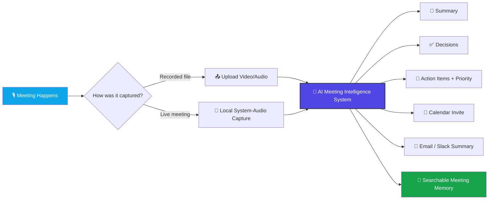
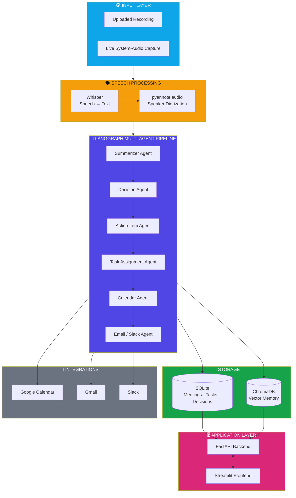
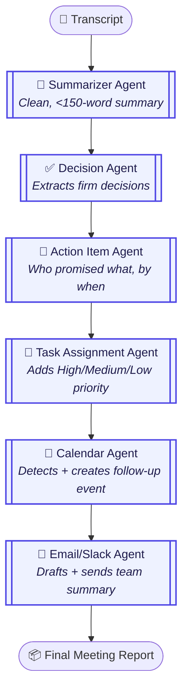

<div align="center">

# 🧠 AI Meeting Intelligence System

### Turn any meeting — recorded or live — into a summary, decisions, action items, a calendar invite, and a ready-to-send email. Automatically.

[](https://www.python.org/)
[](https://www.langchain.com/langgraph)
[](https://github.com/openai/whisper)
[](https://fastapi.tiangolo.com/)
[](https://streamlit.io/)
[]()

</div>

---

## 📖 Table of Contents

- [Overview](#-overview)
- [The Problem](#-the-problem)
- [Proposed Solution](#-proposed-solution)
- [High-Level System Design](#-high-level-system-design)
- [Multi-Agent Architecture](#-multi-agent-architecture)
- [Features](#-features)
- [Tech Stack](#-tech-stack)
- [Project Structure](#-project-structure)
- [Quick Start](#-quick-start)
- [Two Ways To Use It](#-two-ways-to-use-it)
- [Full Documentation](#-full-documentation)
- [Roadmap](#-roadmap)
- [License](#-license)

---

## 🔎 Overview

**AI Meeting Intelligence System** is an end-to-end, **100% free and open-source** platform that behaves like an AI project coordinator sitting in on your meetings. It listens, transcribes, understands the discussion, extracts decisions and action items, schedules follow-ups, notifies your team, and remembers everything — so you can ask it questions about any past meeting, anytime.

It's built as a **portfolio-grade project**: real multi-agent orchestration, real RAG, real speech AI, real integrations — no mocked-out pieces, and no paid API keys required to run it.

---

## 🚩 The Problem

In almost every company, the same pattern repeats after every meeting:

| Pain Point | Impact |
|---|---|
| 📝 Someone manually takes notes | Half-listening, half-writing, error-prone |
| 🤐 Decisions are only spoken, never logged | Forgotten within days |
| 📌 Action items aren't written down | Nobody remembers who promised what |
| ⏱️ Manager writes minutes by hand | 30–60 minutes wasted after every meeting |
| 🔍 No way to search past meetings | "What did we decide about X?" → nobody knows |

None of this needs exotic technology — it's a **workflow automation problem**. The information already exists in the meeting audio. It just isn't captured, structured, or distributed automatically. That's exactly what this system does.

---

## 💡 Proposed Solution



Instead of a human manually producing all six outputs on the right, one system produces all of them automatically, within minutes of the meeting ending.

---

## 🏗️ High-Level System Design



**Why it's layered this way:** each layer is independently swappable. Whisper could be replaced with another STT engine, SQLite could become Postgres, ChromaDB could become a hosted vector DB — none of that would require touching the agent logic.

---

## 🧩 Multi-Agent Architecture

Every agent has exactly **one job** and reads/writes to a single shared `MeetingState`, orchestrated by LangGraph:



> 💬 **A question you'll get in interviews:** *"Why not run these in parallel?"* — Summarizer, Decision, and Action-Item agents don't depend on each other's output, so they *could* fan out from a single node and merge before Task Assignment. This project runs them sequentially for simplicity/debuggability today; parallelizing them is a natural next optimization (see [Roadmap](#-roadmap)).

Separately, a **RAG Agent** gives the system long-term memory:

```mermaid
flowchart LR
    Q([❓ "What did Bob promise last month?"]) --> EMB[Embed Question]
    EMB --> SEARCH[(ChromaDB<br/>Semantic Search)]
    SEARCH --> CTX[Top-K Relevant<br/>Transcript Chunks]
    CTX --> LLM[LLM answers<br/>using ONLY retrieved context]
    LLM --> ANS([💬 Cited Answer])

    style Q fill:#0EA5E9,color:#fff
    style SEARCH fill:#16A34A,color:#fff
    style ANS fill:#4F46E5,color:#fff
```

---

## ✨ Features

- 🎙️ **Speech-to-text** with OpenAI Whisper (runs locally, free)
- 🗣️ **Speaker diarization** — knows who said what
- 🧾 **Automatic summaries** of any meeting
- ✅ **Decision extraction** — never lose track of what was agreed
- 📌 **Action items with owners, deadlines & priority**
- 📅 **Auto-created Google Calendar events** for follow-ups
- 📧 **Auto-drafted, auto-sent email + Slack summaries**
- 🧠 **RAG-powered meeting memory** — ask questions across all past meetings
- 📊 **Analytics** — most active speaker, key topics, sentiment
- 🔴 **Live-meeting capture mode** (system audio, no paid bot needed)
- 💸 **Zero paid APIs required** to run the whole thing

---

## 🛠️ Tech Stack

| Layer | Technology | Why |
|---|---|---|
| LLM | **Groq API** (free tier, Llama 3.1 70B) | Fast + free, no credit card |
| Orchestration | **LangGraph** + LangChain | Multi-agent workflow with shared state |
| Speech-to-Text | **OpenAI Whisper** (local) | Free, runs offline |
| Speaker ID | **pyannote.audio** | Free with HuggingFace token |
| Vector DB | **ChromaDB** + sentence-transformers | Free, local, no server |
| Backend | **FastAPI** | Fast, auto-documented REST API |
| Frontend | **Streamlit** | Fast to build, pure Python UI |
| Database | **SQLite** | Zero-config, single file |
| Calendar | **Google Calendar API** | Free tier |
| Email | **Gmail SMTP (App Password)** | Free |
| Chat | **Slack Incoming Webhooks** | Free |

---

## 📁 Project Structure

```
meeting-ai/
├── backend/          FastAPI app + SQLite database models
├── agents/           Each AI agent (summarizer, decisions, action items, etc.)
├── graph/            LangGraph workflow tying all agents together
├── speech/           Whisper transcription + pyannote speaker diarization
├── rag/              ChromaDB vector store + RAG retriever (meeting memory)
├── live_capture/      Free live-meeting audio capture script
├── frontend/         Streamlit web UI
├── sample_data/       Sample transcript + a no-audio-needed test script
├── requirements.txt
└── .env.example
```

---

## 🚀 Quick Start

```bash
# 1. Unzip and enter the project
cd meeting-ai

# 2. Create a virtual environment
python -m venv venv
source venv/bin/activate        # Windows: venv\Scripts\activate

# 3. Install dependencies
pip install -r requirements.txt

# 4. Add your free API key
cp .env.example .env
# edit .env → add your GROQ_API_KEY (free at console.groq.com)

# 5. Try it instantly with sample data (no audio needed)
python sample_data/test_pipeline_with_sample.py

# 6. Run the full app
uvicorn backend.main:app --reload --port 8000      # Terminal 1
streamlit run frontend/streamlit_app.py             # Terminal 2
```

---

## 🎥 Two Ways To Use It

| Mode | How | Status |
|---|---|---|
| 📤 **Upload a recording** | Upload `.mp3/.wav/.m4a/.mp4` in the Streamlit UI | ✅ Fully working |
| 🔴 **Live meeting** | Run `live_capture/record_system_audio.py` while you're in the call, stop it when the meeting ends | ✅ Working via free system-audio capture (not an official platform bot — see full guide for why) |

---

## 📚 Full Documentation

This README covers the big picture. For the complete guide — installation for every OS, getting all free API keys step-by-step, database setup, a file-by-file code walkthrough, GitHub upload steps, and an interview Q&A bank — see:

📄 **`AI_Meeting_Intelligence_System_Full_Guide.docx`**

---

## 🗺️ Roadmap

- [ ] Parallelize independent agents (Summarizer / Decision / Action-Item) for faster processing
- [ ] Switch to `faster-whisper` for 3–4x faster CPU transcription
- [ ] Automatic real-name speaker mapping (voice enrollment)
- [ ] Direct Jira / GitHub ticket creation from meeting mentions
- [ ] Real-time streaming transcription during live capture

---

## 📄 License

Free to use for learning, portfolio, and interview-preparation purposes.

</div>
